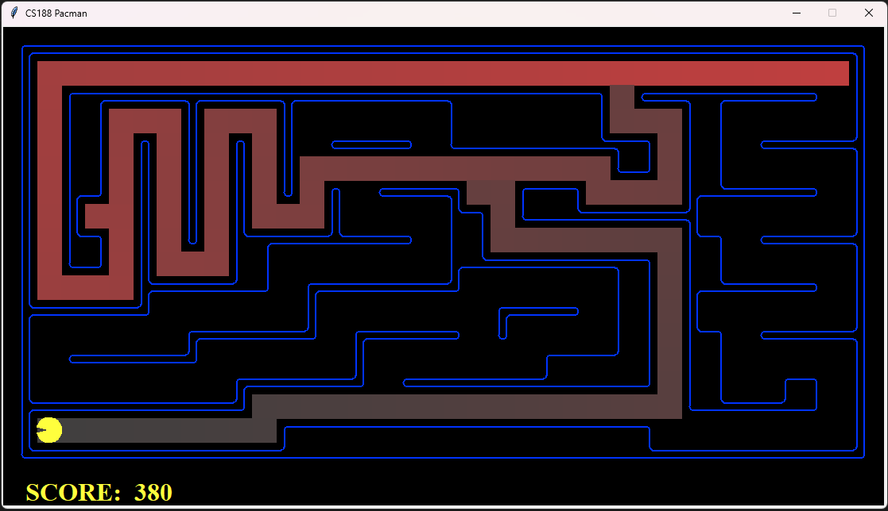

# AI Search Algorithms

Implementation of classical search algorithms in Python including:

- Depth First Search (DFS)
- Breadth First Search (BFS)
- Uniform Cost Search (UCS)
- A* Search

These algorithms were implemented as part of an Artificial Intelligence course project using the UC Berkeley Pacman AI framework.

## Overview

The goal of the project was to explore how different search strategies traverse a state space and how heuristics can dramatically improve pathfinding efficiency.

Agents were tested in grid-based maze environments where Pacman must navigate to reach goal states.

## Algorithms Implemented

**DFS**  
Explores deep paths first before backtracking.

**BFS**  
Explores nodes level by level to guarantee shortest paths in unweighted graphs.

**UCS**  
Expands nodes with the lowest cumulative path cost.

**A\***  
Combines path cost and heuristic estimates to efficiently reach the goal.

## Technologies

Python  
Graph Search  
Heuristic Optimization

## Demonstration

Example runs of the agents solving maze layouts:

## Attribution

This project builds upon the UC Berkeley CS188 Pacman AI framework.
